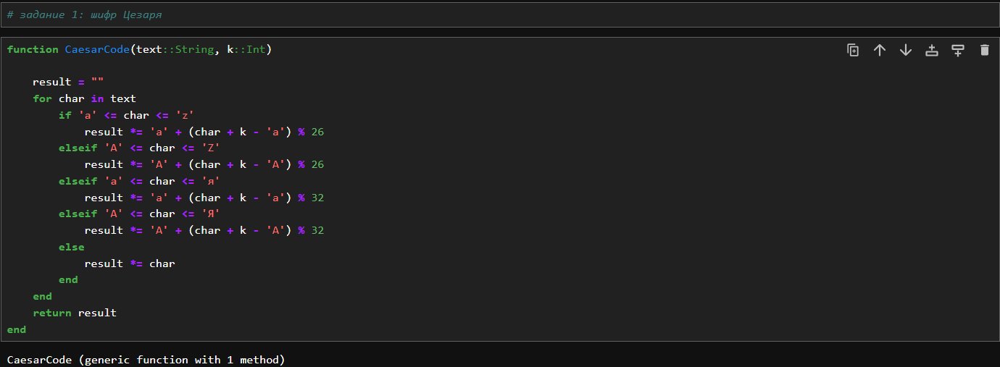
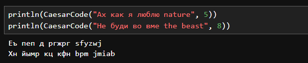
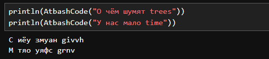

---
## Front matter
lang: ru-RU
title: "Лабораторная работа №1: Презентация."
subtitle: 
  Шифры простой замены.
author: 
    Евдокимов Максим Михайлович. Группа - НФИмд-01-24.\inst{1}
institute: 
    \inst{1}Российский Университет Дружбы Народов

date: 11 сентябрь, 2024, Москва, Россия

## i18n babel
babel-lang: russian
babel-otherlangs: english

## Formatting pdf
toc: false
toc-title: Содержание
slide_level: 2
aspectratio: 169
section-titles: true
theme: metropolis
header-includes:
 - \metroset{progressbar=frametitle,sectionpage=progressbar,numbering=fraction}
 - '\makeatletter'
 - '\beamer@ignorenonframefalse'
 - '\makeatother'
---

# Цели и задачи работы

## Цель лабораторной работы

Изучить простейшие способы шифрования на примере шифра Цезаря и Атбаша.

## Задание

1. Реализовать метод шифрование Цезаря с произвольным ключом k.
2. Реализовать метод шифрование Атбаш.

# Теоретическое введение

## Шифр Цезаря

Шифр Цезаря — это вид шифра подстановки, в котором каждая буква в 
открытом тексте заменяется буквой, находящейся на некотором постоянном 
числе позиций левее или правее неё в алфавите.

## Шифр Атбаш

Шифр Атбаш — это метод шифрования, при котором каждая буква алфавита 
меняется на свою зеркальную (обратную) букву. Например, буква 'A' 
заменяется на 'Z', 'B' на 'Y' и так далее.

# Ход работы

## Задание 1

Реализую шифр Цезаря, создав функцию, получающую на вход слово и 
ключ (число сдвигов) и возвращающую результат. Функция способна принимать
одновременно и русский и английский текст.

{#fig:001 width=70% height=70%}

## Результат 1

Два примера результата вызова функции с различным ключом k

{#fig:002 width=70% height=70%}

## Задание 2

Реализую шифр Атбаш, создав функцию, получающую на вход слово и возвращающую результат.
Функция способна принимать одновременно и русский и английский текст.

{#fig:003 width=70% height=70%}

## Результат 2

Два примера результата вызова функции с разными буквами и словами.

{#fig:004 width=70% height=70%}

# Выводы по проделанной работе

## Вывод

В ходе выполнения лабораторной работы я ознакомился с 
классическими шифрами Цезаря и Атбаш основанных на сдвигах и 
перестановках букв в алфавитах, а также реализовал данные методами шифрования
в Julia.
