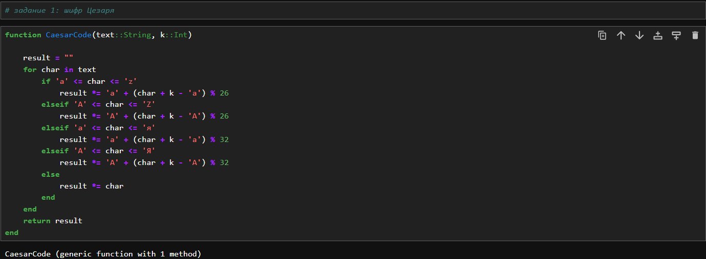
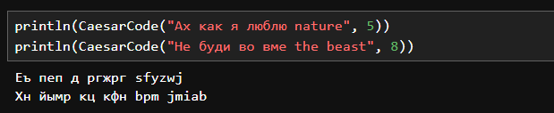
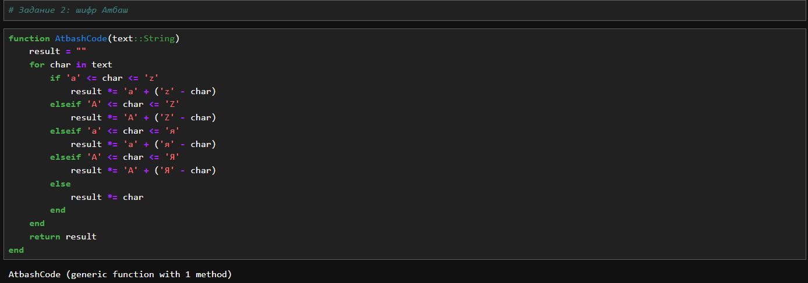
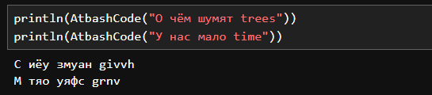

---
## Front matter
lang: ru-RU
title: "Лабораторная работа №1: отчет."
subtitle: "Шифры простой замены"
author: "Евдокимов Максим Михайлович. Группа - НФИмд-01-24."

## Generic otions
lang: ru-RU
toc-title: "Содержание"

## Bibliography
bibliography: bib/cite.bib
csl: pandoc/csl/gost-r-7-0-5-2008-numeric.csl

## Pdf output format
toc: true # Table of contents
toc-depth: 2
lof: true # List of figures
fontsize: 12pt
linestretch: 1.5
papersize: a4
documentclass: scrreprt
## I18n polyglossia
polyglossia-lang:
  name: russian
  options:
	- spelling=modern
	- babelshorthands=true
polyglossia-otherlangs:
  name: english
## I18n babel
babel-lang: russian
babel-otherlangs: english
## Fonts
mainfont: PT Serif
romanfont: PT Serif
sansfont: PT Sans
monofont: PT Mono
mainfontoptions: Ligatures=TeX
romanfontoptions: Ligatures=TeX
sansfontoptions: Ligatures=TeX,Scale=MatchLowercase
monofontoptions: Scale=MatchLowercase,Scale=0.9
## Biblatex
biblatex: true
biblio-style: "gost-numeric"
biblatexoptions:
  - parentracker=true
  - backend=biber
  - hyperref=auto
  - language=auto
  - autolang=other*
  - citestyle=gost-numeric
## Pandoc-crossref LaTeX customization
figureTitle: "Рис."
listingTitle: "Листинг"
lofTitle: "Список иллюстраций"
lotTitle: "Список таблиц"
lolTitle: "Листинги"
## Misc options
indent: true
header-includes:
  - \usepackage{indentfirst}
  - \usepackage{float} # keep figures where there are in the text
  - \floatplacement{figure}{H} # keep figures where there are in the text
---

# Цели и задачи работы

## Цель лабораторной работы

Изучить простейшие способы шифрования на примере шифра Цезаря и Атбаша.

## Задание

1. Реализовать метод шифрование Цезаря с произвольным ключом k.
2. Реализовать метод шифрование Атбаш.

# Теоретическое введение

## Шифр Цезаря

Шифр Цезаря — это вид шифра подстановки, в котором каждая буква в 
открытом тексте заменяется буквой, находящейся на некотором постоянном 
числе позиций левее или правее неё в алфавите.

## Шифр Атбаш

Шифр Атбаш — это метод шифрования, при котором каждая буква алфавита 
меняется на свою зеркальную (обратную) букву. Например, буква 'A' 
заменяется на 'Z', 'B' на 'Y' и так далее.

# Ход работы

## Задание 1

Реализую шифр Цезаря, создав функцию, получающую на вход слово и 
ключ (число сдвигов) и возвращающую результат. Функция способна принимать
одновременно и русский и английский текст.

{#fig:001 width=70% height=70%}

## Результат 1

Два примера результата вызова функции с различным ключом k

{#fig:002 width=70% height=70%}

## Задание 2

Реализую шифр Атбаш, создав функцию, получающую на вход слово и возвращающую результат.
Функция способна принимать одновременно и русский и английский текст.

{#fig:003 width=70% height=70%}

## Результат 2

Два примера результата вызова функции с разными буквами и словами.

{#fig:004 width=70% height=70%}

# Выводы по проделанной работе

## Вывод

В ходе выполнения лабораторной работы я ознакомился с 
классическими шифрами Цезаря и Атбаш основанных на сдвигах и 
перестановках букв в алфавитах, а также реализовал данные методами шифрования
в Julia.

# Список литературы {.unnumbered}

1. [Лабораторная работа №1](https://esystem.rudn.ru/pluginfile.php/2368506/mod_folder/content/0/lab01.pdf?forcedownload=1)
2. [Правила работы со String и Char в Julia](https://docs.julialang.org/en/v1/manual/strings/)
