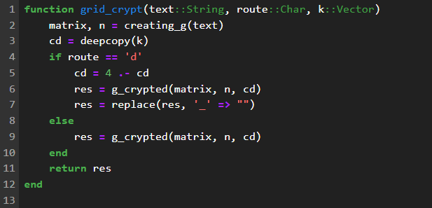
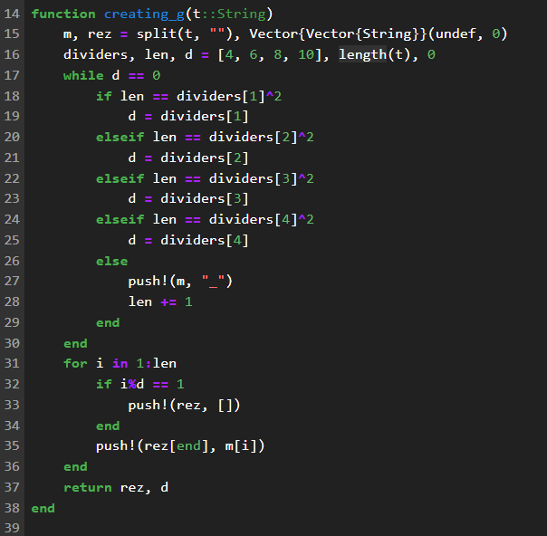
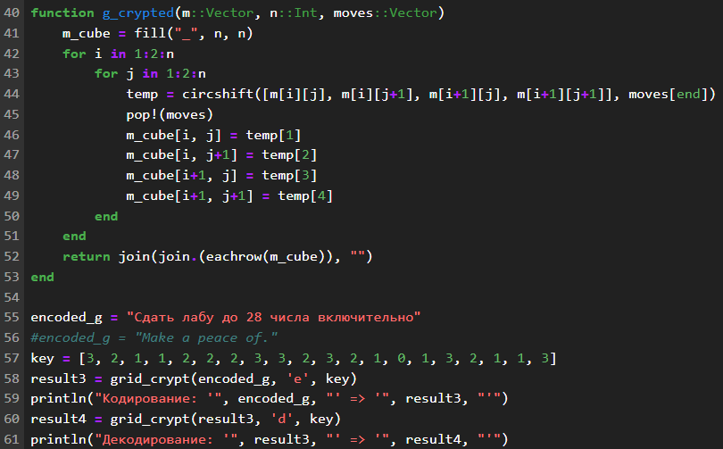
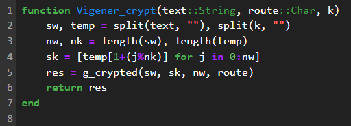
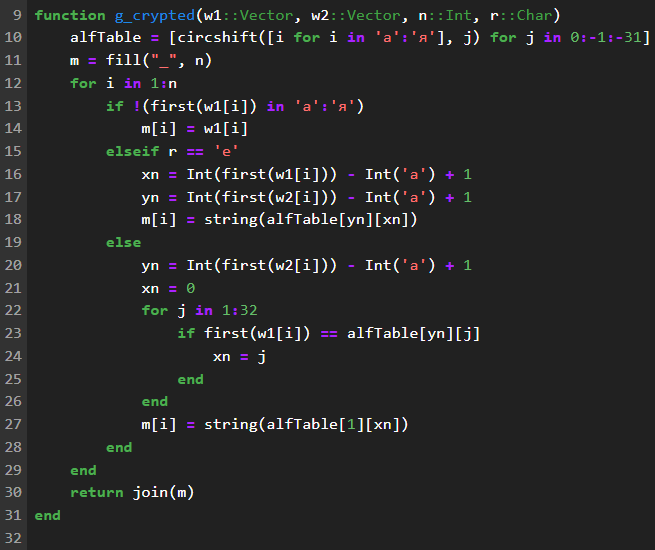
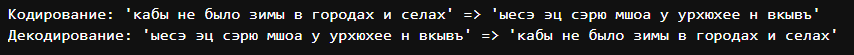

---
## Front matter
lang: ru-RU
title: "Лабораторная работа №2: отчет."
subtitle: "Шифры перестановки"
author: "Евдокимов Максим Михайлович. Группа - НФИмд-01-24."

## Generic otions
lang: ru-RU
toc-title: "Содержание"

## Bibliography
bibliography: bib/cite.bib
csl: pandoc/csl/gost-r-7-0-5-2008-numeric.csl

## Pdf output format
toc: true # Table of contents
toc-depth: 2
lof: true # List of figures
fontsize: 12pt
linestretch: 1.5
papersize: a4
documentclass: scrreprt
## I18n polyglossia
polyglossia-lang:
  name: russian
  options:
	- spelling=modern
	- babelshorthands=true
polyglossia-otherlangs:
  name: english
## I18n babel
babel-lang: russian
babel-otherlangs: english
## Fonts
mainfont: PT Serif
romanfont: PT Serif
sansfont: PT Sans
monofont: PT Mono
mainfontoptions: Ligatures=TeX
romanfontoptions: Ligatures=TeX
sansfontoptions: Ligatures=TeX,Scale=MatchLowercase
monofontoptions: Scale=MatchLowercase,Scale=0.9
## Biblatex
biblatex: true
biblio-style: "gost-numeric"
biblatexoptions:
  - parentracker=true
  - backend=biber
  - hyperref=auto
  - language=auto
  - autolang=other*
  - citestyle=gost-numeric
## Pandoc-crossref LaTeX customization
figureTitle: "Рис."
listingTitle: "Листинг"
lofTitle: "Список иллюстраций"
lotTitle: "Список таблиц"
lolTitle: "Листинги"
## Misc options
indent: true
header-includes:
  - \usepackage{indentfirst}
  - \usepackage{float} # keep figures where there are in the text
  - \floatplacement{figure}{H} # keep figures where there are in the text
---

# Цели и задачи работы

## Цель лабораторной работы

Изучить способы шифрования методом перестановки разного типа.

## Задание

1. Реализовать метод Маршрутного шифрования.
2. Реализовать метод шифрования с помощью решеток.
3. Реализовать метод шифрования через таблицу Виженера.

# Теоретическое введение

## Маршрутное шифрование

Маршрутное шифрование (также известное как маршрутное транспонирование) — 
это метод шифрования, при котором открытый текст записывается в матрицу 
(таблицу) по определенному маршруту, а затем считывается по другому маршруту 
для получения шифрованного текста. Основная идея заключается в изменении 
порядка символов в соответствии с заданным маршрутом.

### Алгоритм действий маршрутного шифрования:

1. Выбор матрицы и маршрутов

- Размер матрицы: Определите размер матрицы n.
- Маршрут записи: Определите маршрут, по которому будут записываться
символы открытого текста в матрицу.
- Маршрут считывания: Определите маршрут, по которому будут считываться
символы из матрицы для получения шифрованного текста.

2. Запись открытого текста в матрицу

- Заполнение матрицы: Запишите символы открытого текста в матрицу по
выбранному маршруту записи. Если текст короче, чем размер матрицы,
можно добавить фиктивные символы (могут быть технически любым).

3. Считывание шифрованного текста

- Считывание матрицы: Считайте символы из матрицы по выбранному маршруту
считывания. Результат будет шифрованным текстом.

4. Дешифрование

- Запись шифрованного текста в матрицу: Запишите символы шифрованного текста в 
матрицу по маршруту считывания.
- Считывание открытого текста: Считайте символы из матрицы по маршруту записи.
Результат будет открытым текстом.

## Шифрование с помощью решеток

Шифрование с помощью решёток (также известное как "шифр Кардано") - это
метод криптографии, основанный на использовании специальной трафаретной маски,
называемой "решёткой".

### Алгоритм действий Шифрование с помощью решеток

1. Создание решёток:

- Решётка для шифрования (E-решётка):

Это квадратная матрица размером NxN клеток (обычно 4x4, 6x6 или 8x8).
В некоторых клетках матрицы проделаны отверстия.
Отверстия расположены таким образом, что при повороте решётки на 90 градусов,
180 градусов и 270 градусов, они не совпадают с предыдущими положениями.
За один полный оборот решётки (360 градусов) отверстия проходят через все
клетки матрицы.

- Решётка для расшифровки (D-решётка):

Это также квадратная матрица размером NxN клеток.
Отверстия в D-решётке расположены таким образом, чтобы при наложении на 
E-решётку в определённом положении, отверстия совпадали с теми клетками, 
в которые были записаны символы.

2. Запись сообщения:

- E-решётка накладывается на чистый лист бумаги.
- Сообщение записывается в отверстия E-решётки.
- Затем E-решётка поворачивается на 90 градусов и сообщение продолжает 
записываться в следующие отверстия.
- Процесс повторяется до тех пор, пока E-решётка не будет повернута на 
360 градусов.
- В результате на листе бумаги остаётся зашифрованное сообщение,
состоящее из символов, расположенных в случайном порядке.

3. Расшифровка сообщения:

- D-решётка накладывается на зашифрованное сообщение в определённом
положении. Символы, расположенные в отверстиях D-решётки, читаются и записываются.
- Затем D-решётка поворачивается на 90 градусов и процесс повторяется.
- Процесс повторяется до тех пор, пока D-решётка не будет повернута
на 360 градусов.
- В результате будет прочитано исходное сообщение.

## Шифрование через таблицу Виженера

Таблица Виженера (также известная как шифр Виженера) - это метод
полиалфавитного шифрования, который использует ключевое слово для сдвига
букв исходного текста на разные позиции в алфавите. Это делает шифр более
стойким, чем простые моноалфавитные шифры, такие как шифр Цезаря.

### Алгоритм действий для метода таблицу Виженера

1. Таблица Виженера:

- Таблица Виженера представляет собой квадратную матрицу, состоящую из 26
строк и 26 столбцов.
- Каждая строка соответствует сдвигу алфавита на определённое
количество позиций. Например, первая строка - это обычный алфавит,
вторая строка - алфавит со сдвигом на 1 позицию, третья строка - со
сдвигом на 2 позиции и так далее.

2. Ключевое слово:

- Ключевое слово - это слово или фраза, которая используется для 
шифрования сообщения.
- Длина ключевого слова должна быть не меньше длины сообщения. 
- Если ключевое слово короче, оно повторяется до тех пор, пока не достигнет 
нужной длины.

3. Шифрование:

- Для каждой буквы исходного текста находится соответствующая буква ключевого слова.
- В таблице Виженера находится пересечение строки, соответствующей букве исходного текста, и столбца, соответствующего букве ключевого слова.
- Буква на пересечении этих строки и столбца является зашифрованной буквой.

4. Расшифровка:

- Для расшифровки используется то же ключевое слово.
- Для каждой буквы зашифрованного текста находится соответствующая буква ключевого слова.
- В таблице Виженера находится строка, соответствующая букве ключевого слова.
- В этой строке находится буква, соответствующая зашифрованной букве. Эта буква является исходной буквой.

# Ход работы

## Задание 1

Создание кода для маршрутного шифрования:

{#fig:001}

---

{#fig:002}

---

{#fig:003}

## Результат 1

{#fig:004}

## Задание 2

Создание кода для шифра с помощью решеток:

{#fig:005}

---

{#fig:006}

---

{#fig:007}

## Результат 2

{#fig:008}

## Задание 3

Создание кода для шифрования через таблицу Виженера:

{#fig:009}

---

{#fig:010}

---

{#fig:011}

## Результат 3

{#fig:012}

# Выводы по проделанной работе

## Вывод

В ходе выполнения лабораторной работы я изучил представленные
3 вида шифра перестановки: Маршрутное шифрование,
Шифрование с помощью решеток и таблица Вижинера. А также
реализовал на языке программирования Julia методы шифрования
и дешифрования для каждого шифра.

# Список литературы {.unnumbered}

1. [Лабораторная работа №2](https://esystem.rudn.ru/pluginfile.php/2368506/mod_folder/content/0/lab02.pdf?forcedownload=1)
2. [Strings - Julia documentation](https://docs.julialang.org/en/v1/manual/strings/)
3. [Functions - Julia documentation](https://docs.julialang.org/en/v1/manual/functions/)
