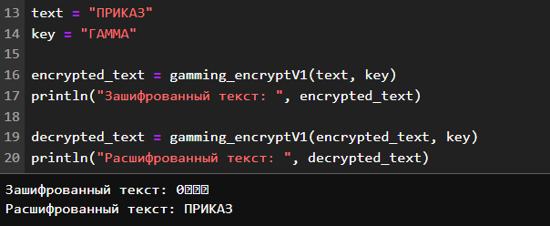
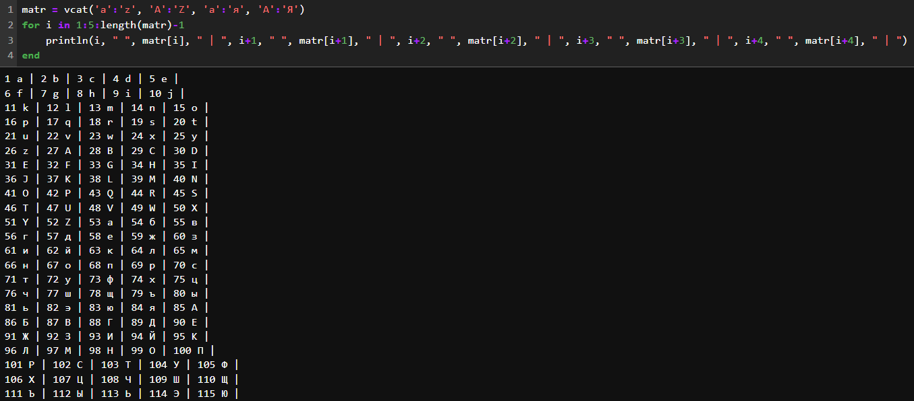

---
## Front matter
lang: ru-RU
title: "Лабораторная работа №3: Презентация."
subtitle: 
  Шифры простой замены.
author: 
    Евдокимов Максим Михайлович. Группа - НФИмд-01-24.\inst{1}
institute: 
    \inst{1}Российский Университет Дружбы Народов

date: 29 сентябрь, 2024, Москва, Россия

## i18n babel
babel-lang: russian
babel-otherlangs: english

## Formatting pdf
toc: false
toc-title: Содержание
slide_level: 2
aspectratio: 169
section-titles: true
theme: metropolis
header-includes:
 - \metroset{progressbar=frametitle,sectionpage=progressbar,numbering=fraction}
 - '\makeatletter'
 - '\beamer@ignorenonframefalse'
 - '\makeatother'
---

# Цели и задачи работы

## Цель лабораторной работы

Изучить понятие Гаммирование и его особенности и типы.

## Задание

Реализовать алгоритм шифрования гаммированием конечной гаммой.

# Теоретическое введение

Гаммирование — это метод шифрования, при котором каждый символ открытого 
текста складывается с соответствующим символом гаммы (ключа) для получения 
зашифрованного текста. Гамма — это последовательность символов, которая 
используется для шифрования.

## Справка по способам

Процедура наложения гаммы на исходный текст может быть различной. Например, 
символы исходного текста и гаммы заменяются цифровыми эквивалентами, которые 
затем складываются или вычитаются. Или символы исходного текста и гаммы 
представляются в виде двоичного кода, затем соответствующие разряды 
складываются по модулю 2. Также можно использовать преобразование по правилу 
логической эквивалентности (неэквивалентности) и другие логические операции.   

В качестве гаммы может быть использована любая последовательность случайных 
символов, например, последовательность цифр числа пи (3,14...). При ручном 
шифровании для формирования случайной цифровой последовательности любой длины 
можно использовать фортунку-рулетку, раскручивая стрелку. Шкала вертушки 
разделена на 10 равных секторов, которые помечены цифрами от 0 до 9.

## Алгоритм Гаммирования: Бесконечный случай

- Гамма: Бесконечная псевдослучайная последовательность символов.

Шифрование:

1. Для каждого символа открытого текста P[i] и соответствующего символа гаммы G[i].
2. Вычислить зашифрованный символ C[i] = P[i] ⊕ G[i] (побитовое XOR).

Дешифрование:

1. Для каждого символа зашифрованного текста C[i] и соответствующего символа гаммы G[i].
2. Вычислить открытый символ P[i] = C[i] ⊕ G[i] (побитовое XOR).

## Алгоритм Гаммирования: Конечная гамма

- Гамма: Конечная последовательность символов, которая повторяется, если 
длина открытого текста превышает длину гаммы.

Шифрование:

1. Для каждого символа открытого текста P[i] и соответствующего символа гаммы G[i % len(G)].
2. Вычислить зашифрованный символ C[i] = P[i] ⊕ G[i % len(G)] (побитовое XOR).

Дешифрование:

1. Для каждого символа зашифрованного текста C[i] и соответствующего символа гаммы G[i % len(G)].
2. Вычислить открытый символ P[i] = C[i] ⊕ G[i % len(G)] (побитовое XOR).

# Ход работы

В ходе выполнения задания было создано 2 вариант простейшего гаммирования 
на основе логической операции XOR.

## Вариант 1

В первом варианте реализации метода Гаммирования я использовал
возможности Julia для использования всего диапазона всех 
ASCII/Unicode символов.

{#fig:001 width=70% height=70%}

## Результат 1

{#fig:002 width=70% height=70%}

## Вариант 2

Для второго варианта реализации метода Гаммирования уже был
создан список символов состоящих из обычных и заглавных букв 
русского и английского алфавита.

---

{#fig:003 width=70% height=70%}

---

{#fig:004 width=70% height=70%}

## Результат 2

{#fig:005 width=70% height=70%}

# Выводы по проделанной работе

## Вывод

В ходе выполнения лабораторной работы было изучено понятие 
гаммирование и его принципах работы. Применены некоторые способы 
его реализации и рассмотрены разные его типы.
