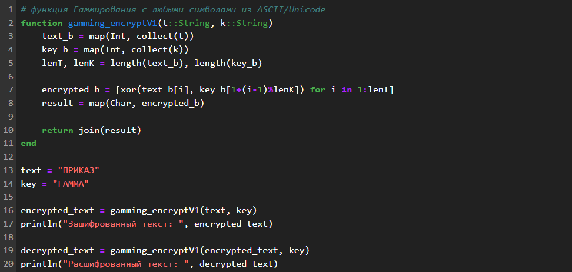
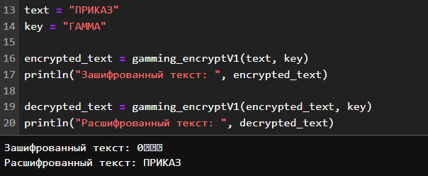
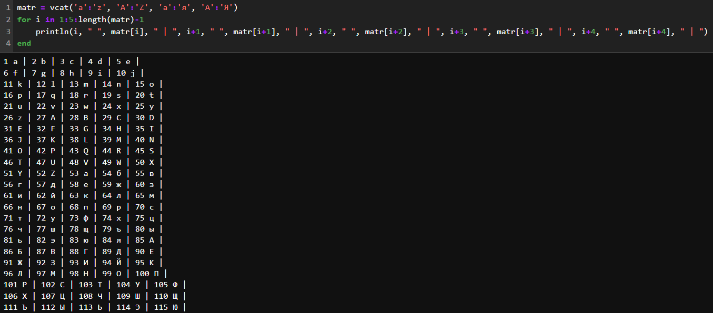
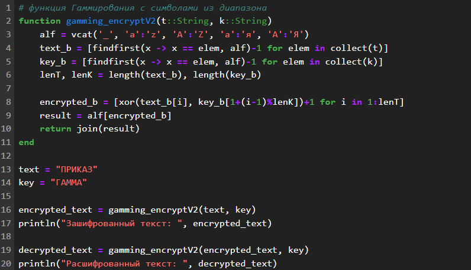
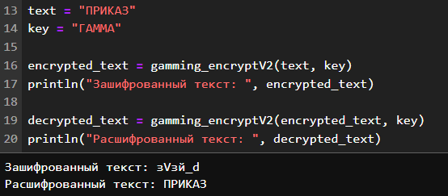

---
## Front matter
lang: ru-RU
title: "Лабораторная работа №3: отчет."
subtitle: "Шифры простой замены"
author: "Евдокимов Максим Михайлович. Группа - НФИмд-01-24."

## Generic otions
lang: ru-RU
toc-title: "Содержание"

## Bibliography
bibliography: bib/cite.bib
csl: pandoc/csl/gost-r-7-0-5-2008-numeric.csl

## Pdf output format
toc: true # Table of contents
toc-depth: 2
lof: true # List of figures
fontsize: 12pt
linestretch: 1.5
papersize: a4
documentclass: scrreprt
## I18n polyglossia
polyglossia-lang:
  name: russian
  options:
	- spelling=modern
	- babelshorthands=true
polyglossia-otherlangs:
  name: english
## I18n babel
babel-lang: russian
babel-otherlangs: english
## Fonts
mainfont: PT Serif
romanfont: PT Serif
sansfont: PT Sans
monofont: PT Mono
mainfontoptions: Ligatures=TeX
romanfontoptions: Ligatures=TeX
sansfontoptions: Ligatures=TeX,Scale=MatchLowercase
monofontoptions: Scale=MatchLowercase,Scale=0.9
## Biblatex
biblatex: true
biblio-style: "gost-numeric"
biblatexoptions:
  - parentracker=true
  - backend=biber
  - hyperref=auto
  - language=auto
  - autolang=other*
  - citestyle=gost-numeric
## Pandoc-crossref LaTeX customization
figureTitle: "Рис."
listingTitle: "Листинг"
lofTitle: "Список иллюстраций"
lotTitle: "Список таблиц"
lolTitle: "Листинги"
## Misc options
indent: true
header-includes:
  - \usepackage{indentfirst}
  - \usepackage{float} # keep figures where there are in the text
  - \floatplacement{figure}{H} # keep figures where there are in the text
---

# Цели и задачи работы

## Цель лабораторной работы

Изучить понятие Гаммирование и его особенности и типы.

## Задание

Реализовать алгоритм шифрования гаммированием конечной гаммой.

# Теоретическое введение

Гаммирование — это метод шифрования, при котором каждый символ открытого 
текста складывается с соответствующим символом гаммы (ключа) для получения 
зашифрованного текста. Гамма — это последовательность символов, которая 
используется для шифрования.

## Справка по способам

Процедура наложения гаммы на исходный текст может быть различной. Например, 
символы исходного текста и гаммы заменяются цифровыми эквивалентами, которые 
затем складываются или вычитаются. Или символы исходного текста и гаммы 
представляются в виде двоичного кода, затем соответствующие разряды 
складываются по модулю 2. Также можно использовать преобразование по правилу 
логической эквивалентности (неэквивалентности) и другие логические операции.   

В качестве гаммы может быть использована любая последовательность случайных 
символов, например, последовательность цифр числа пи (3,14...). При ручном 
шифровании для формирования случайной цифровой последовательности любой длины 
можно использовать фортунку-рулетку, раскручивая стрелку. Шкала вертушки 
разделена на 10 равных секторов, которые помечены цифрами от 0 до 9.

## Алгоритм Гаммирования: Бесконечный случай

- Гамма: Бесконечная псевдослучайная последовательность символов.

Шифрование:

1. Для каждого символа открытого текста P[i] и соответствующего символа гаммы G[i].
2. Вычислить зашифрованный символ C[i] = P[i] ⊕ G[i] (побитовое XOR).

Дешифрование:

1. Для каждого символа зашифрованного текста C[i] и соответствующего символа гаммы G[i].
2. Вычислить открытый символ P[i] = C[i] ⊕ G[i] (побитовое XOR).

## Алгоритм Гаммирования: Конечная гамма

- Гамма: Конечная последовательность символов, которая повторяется, если 
длина открытого текста превышает длину гаммы.

Шифрование:

1. Для каждого символа открытого текста P[i] и соответствующего символа гаммы G[i % len(G)].
2. Вычислить зашифрованный символ C[i] = P[i] ⊕ G[i % len(G)] (побитовое XOR).

Дешифрование:

1. Для каждого символа зашифрованного текста C[i] и соответствующего символа гаммы G[i % len(G)].
2. Вычислить открытый символ P[i] = C[i] ⊕ G[i % len(G)] (побитовое XOR).

# Ход работы

В ходе выполнения задания было создано 2 вариант простейшего гаммирования 
на основе логической операции XOR.

## Вариант 1

В первом варианте реализации метода Гаммирования я использовал
возможности Julia для использования всего диапазона всех 
ASCII/Unicode символов.

{#fig:001 width=70% height=70%}

## Результат 1

{#fig:002 width=70% height=70%}

## Вариант 2

Для второго варианта реализации метода Гаммирования уже был
создан список символов состоящих из обычных и заглавных букв 
русского и английского алфавита.

{#fig:003 width=70% height=70%}

{#fig:004 width=70% height=70%}

## Результат 2

{#fig:005 width=70% height=70%}

# Выводы по проделанной работе

## Вывод

В ходе выполнения лабораторной работы было изучено понятие 
гаммирование и его принципах работы. Применены некоторые способы 
его реализации и рассмотрены разные его типы.

# Список литературы {.unnumbered}

1. [Шифрование методом гаммирования](https://studfile.net/preview/9721709/page:5/)
2. [МАТЕМАТИЧЕСКИЕ МЕТОДЫ ЗАЩИТЫ ИНФОРМАЦИИ Рацеева С.М. (стр. 292)](https://www.ulsu.ru/media/documents/Рацеев_С.М._Математические_методы_защиты_информации.pdf)
3. [88-97, 174. метод гаммирования Евгений Александрович Лыгин](https://proza.ru/2024/03/10/839)
