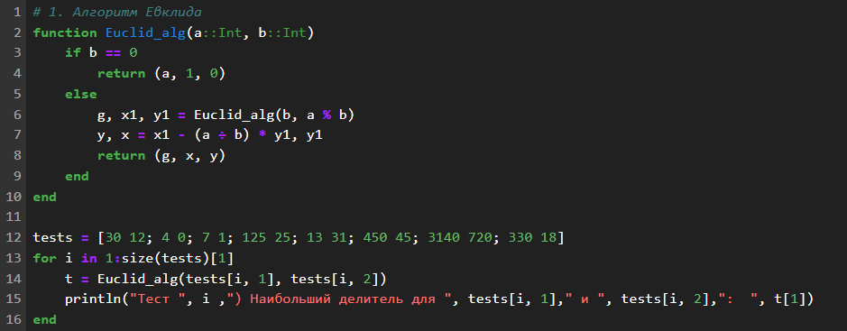
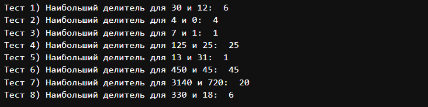
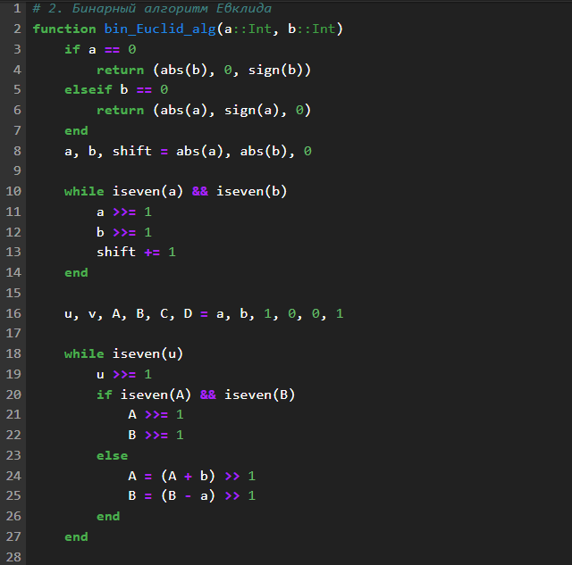
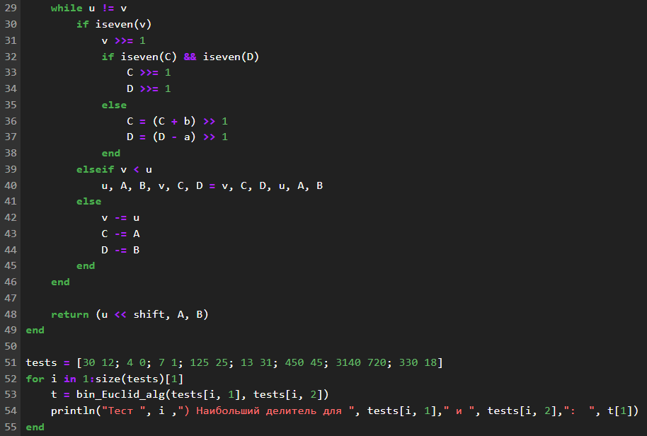
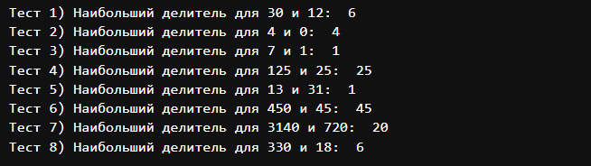
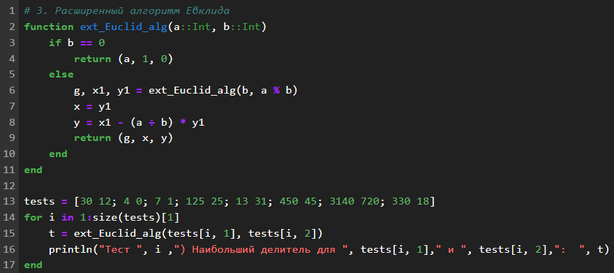
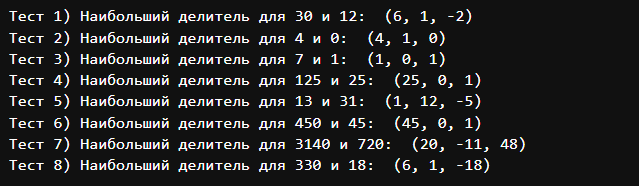
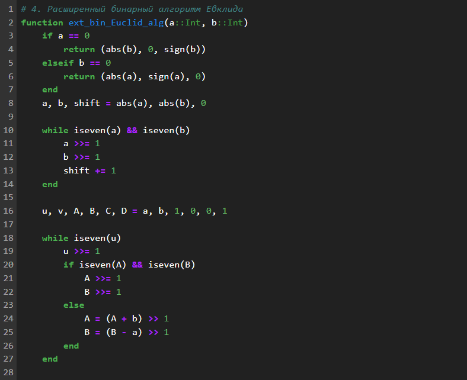
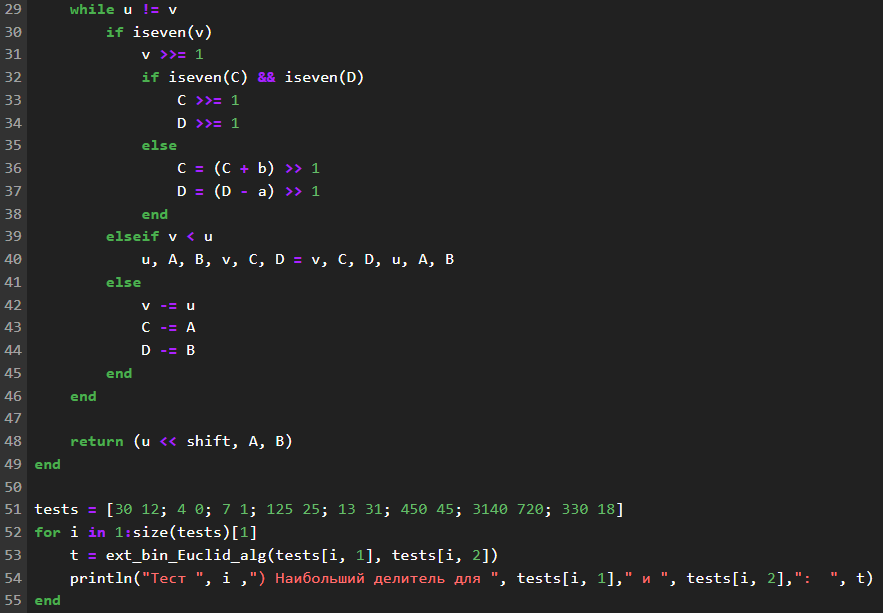
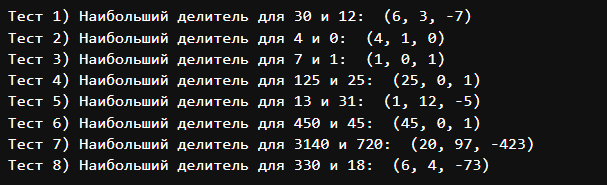

---
## Front matter
lang: ru-RU
title: "Лабораторная работа №4: Презентация."
subtitle: 
  Вычисление наибольшего общего делителя
author: 
    Евдокимов Максим Михайлович. Группа - НФИмд-01-24.\inst{1}
institute: 
    \inst{1}Российский Университет Дружбы Народов

date: 30 сентябрь, 2024, Москва, Россия

## i18n babel
babel-lang: russian
babel-otherlangs: english

## Formatting pdf
toc: false
toc-title: Содержание
slide_level: 2
aspectratio: 169
section-titles: true
theme: metropolis
header-includes:
 - \metroset{progressbar=frametitle,sectionpage=progressbar,numbering=fraction}
 - '\makeatletter'
 - '\beamer@ignorenonframefalse'
 - '\makeatother'
---

# Цели и задачи работы

## Цель лабораторной работы

Изучить и реализовать все представленные методы Евклида.

## Задание

1. Реализовать классический алгоритм Евклида.
2. Реализовать бинарный алгоритм Евклида.
3. Реализовать расширенный алгоритм Евклида.
4. Реализовать расширенный бинарный алгоритм Евклида.

# Теоретическое введение

## Классический алгоритм Евклида:

### Особенности:

  - Основан на делении с остатком. 
  - Простейший и исторически первый вариант.

### Алгоритм:

  - Делим большее число на меньшее, получаем остаток.
  - Заменяем большее число на меньшее, а меньшее - на остаток.
  - Повторяем, пока остаток не станет равен нулю.

Последний ненулевой остаток - НОД.

## Бинарный алгоритм Евклида:

### Особенности:

  - Основан на битовых операциях (сдвиги, сложение, вычитание).
  - Работает быстрее на больших числах, чем классический.

### Алгоритм:

  - Используем свойства НОД: НОД(2a, 2b) = 2 * НОД(a, b), НОД(2a, b) = НОД(a, b) если b нечетно.
  - Делим числа на 2, пока они оба не станут нечетными.
  - Вычитаем меньшее из большего, пока они не сравняются.
  - Умножаем результат на степени двойки, на которые мы делили.

## Расширенный алгоритм Евклида:

Особенности:

Находит не только НОД, но и коэффициенты x, y такие, что ax + by = НОД(a, b).

Важен для решения диофантовых уравнений и работы с модульной арифметикой.

Алгоритм:

Выполняем классический алгоритм, сохраняя промежуточные результаты.

Выражаем НОД через исходные числа, используя промежуточные результаты.

## Расширенный бинарный алгоритм Евклида:

Особенности:

Сочетает в себе преимущества бинарного и расширенного алгоритмов.

Эффективен и находит коэффициенты x, y.

Алгоритм:

Выполняем бинарный алгоритм, сохраняя промежуточные результаты.

Выражаем НОД через исходные числа, используя промежуточные результаты.

# Ход работы

## Задание 1

{#fig:001 width=70% height=70%}

## Результат 1

{#fig:002 width=70% height=70%}

## Задание 2

{#fig:003 width=70% height=70%}

{#fig:004 width=70% height=70%}

## Результат 2

{#fig:005 width=70% height=70%}

## Задание 3

{#fig:006 width=70% height=70%}

## Результат 3

{#fig:007 width=70% height=70%}

## Задание 4

{#fig:008 width=70% height=70%}

{#fig:009 width=70% height=70%}

## Результат 4

{#fig:010 width=70% height=70%}

# Выводы по проделанной работе

## Вывод

В ходе выполнения лабораторной работы я ознакомился и реализовал
разные варианты алгоритма Евклида для нахождения наибольшего 
общего делителя. И в результате был сделан очевидный вывод:

- Классический алгоритм - простой и исторически первый.
- Бинарный алгоритм - быстрее на больших числах.
- Расширенный алгоритм - находит коэффициенты x, y.
- Расширенный бинарный алгоритм - сочетает в себе преимущества всех вышеперечисленных.

И есть другие более гибкие и универсальные способы которые 
часто используют в своей основе методы связанные с алгоритмом Евклида.
