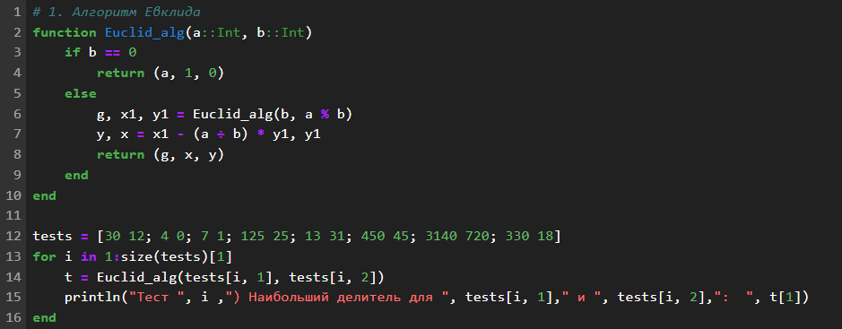
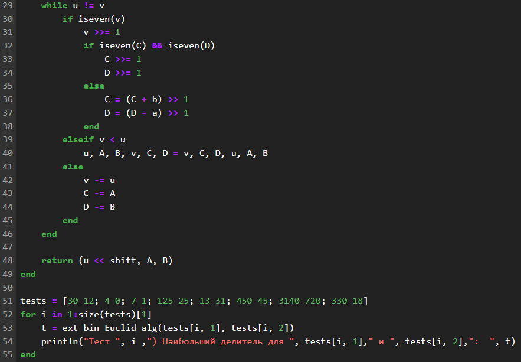
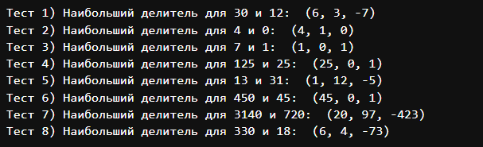

---
## Front matter
lang: ru-RU
title: "Лабораторная работа №4: отчет."
subtitle: "Шифры простой замены"
author: "Евдокимов Максим Михайлович. Группа - НФИмд-01-24."

## Generic otions
lang: ru-RU
toc-title: "Содержание"

## Bibliography
bibliography: bib/cite.bib
csl: pandoc/csl/gost-r-7-0-5-2008-numeric.csl

## Pdf output format
toc: true # Table of contents
toc-depth: 2
lof: true # List of figures
fontsize: 12pt
linestretch: 1.5
papersize: a4
documentclass: scrreprt
## I18n polyglossia
polyglossia-lang:
  name: russian
  options:
	- spelling=modern
	- babelshorthands=true
polyglossia-otherlangs:
  name: english
## I18n babel
babel-lang: russian
babel-otherlangs: english
## Fonts
mainfont: PT Serif
romanfont: PT Serif
sansfont: PT Sans
monofont: PT Mono
mainfontoptions: Ligatures=TeX
romanfontoptions: Ligatures=TeX
sansfontoptions: Ligatures=TeX,Scale=MatchLowercase
monofontoptions: Scale=MatchLowercase,Scale=0.9
## Biblatex
biblatex: true
biblio-style: "gost-numeric"
biblatexoptions:
  - parentracker=true
  - backend=biber
  - hyperref=auto
  - language=auto
  - autolang=other*
  - citestyle=gost-numeric
## Pandoc-crossref LaTeX customization
figureTitle: "Рис."
listingTitle: "Листинг"
lofTitle: "Список иллюстраций"
lotTitle: "Список таблиц"
lolTitle: "Листинги"
## Misc options
indent: true
header-includes:
  - \usepackage{indentfirst}
  - \usepackage{float} # keep figures where there are in the text
  - \floatplacement{figure}{H} # keep figures where there are in the text
---

# Цели и задачи работы

## Цель лабораторной работы

Изучить и реализовать все представленные методы Евклида.

## Задание

1. Реализовать классический алгоритм Евклида.
2. Реализовать бинарный алгоритм Евклида.
3. Реализовать расширенный алгоритм Евклида.
4. Реализовать расширенный бинарный алгоритм Евклида.

# Теоретическое введение

## Классический алгоритм Евклида:

### Особенности:

  - Основан на делении с остатком. 
  - Простейший и исторически первый вариант.

### Алгоритм:

  - Делим большее число на меньшее, получаем остаток.
  - Заменяем большее число на меньшее, а меньшее - на остаток.
  - Повторяем, пока остаток не станет равен нулю.

Последний ненулевой остаток - НОД.

## Бинарный алгоритм Евклида:

### Особенности:

  - Основан на битовых операциях (сдвиги, сложение, вычитание).
  - Работает быстрее на больших числах, чем классический.

### Алгоритм:

  - Используем свойства НОД: НОД(2a, 2b) = 2 * НОД(a, b), НОД(2a, b) = НОД(a, b) если b нечетно.
  - Делим числа на 2, пока они оба не станут нечетными.
  - Вычитаем меньшее из большего, пока они не сравняются.
  - Умножаем результат на степени двойки, на которые мы делили.

## Расширенный алгоритм Евклида:

### Особенности:

  - Находит не только НОД, но и коэффициенты x, y такие, что ax + by = НОД(a, b).
  - Важен для решения диофантовых уравнений и работы с модульной арифметикой.

### Алгоритм:

  - Выполняем классический алгоритм, сохраняя промежуточные результаты.
  - Выражаем НОД через исходные числа, используя промежуточные результаты.

## Расширенный бинарный алгоритм Евклида:

### Особенности:

  - Сочетает в себе преимущества бинарного и расширенного алгоритмов.
  - Эффективен и находит коэффициенты x, y.

### Алгоритм:

  - Выполняем бинарный алгоритм, сохраняя промежуточные результаты.
  - Выражаем НОД через исходные числа, используя промежуточные результаты.

# Ход работы

## Задание 1

{#fig:001 width=70% height=70%}

## Результат 1

{#fig:002 width=70% height=70%}

## Задание 2

{#fig:003 width=70% height=70%}

{#fig:004 width=70% height=70%}

## Результат 2

{#fig:005 width=70% height=70%}

## Задание 3

{#fig:006 width=70% height=70%}

## Результат 3

{#fig:007 width=70% height=70%}

## Задание 4

{#fig:008 width=70% height=70%}

{#fig:009 width=70% height=70%}

## Результат 4

{#fig:010 width=70% height=70%}

# Выводы по проделанной работе

## Вывод

В ходе выполнения лабораторной работы я ознакомился и реализовал
разные варианты алгоритма Евклида для нахождения наибольшего 
общего делителя. И в результате был сделан очевидный вывод:

- Классический алгоритм - простой и исторически первый.
- Бинарный алгоритм - быстрее на больших числах.
- Расширенный алгоритм - находит коэффициенты x, y.
- Расширенный бинарный алгоритм - сочетает в себе преимущества всех вышеперечисленных.

И есть другие более гибкие и универсальные способы которые 
часто используют в своей основе методы связанные с алгоритмом Евклида.

# Список литературы {.unnumbered}

1. [В очередной раз о НОД, алгоритме Евклида и немного об истории алгоритмов вообще](https://habr.com/ru/articles/464949/)
2. [Евклидовы алгоритмы (базовые и расширенные)](https://translated.turbopages.org/proxy_u/en-ru.ru.bab5b8f3-66fa9e9d-49e397bd-74722d776562/https/www.geeksforgeeks.org/euclidean-algorithms-basic-and-extended/)
3. [8 способов нахождения наибольшего общего делителя](https://code-live.ru/post/greatest-common-denominator-algorithms/)
4. [Вычисление НОД — ошибка, которой не замечают](https://habr.com/ru/articles/205106/)
