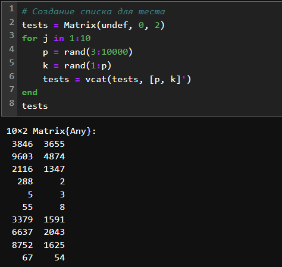
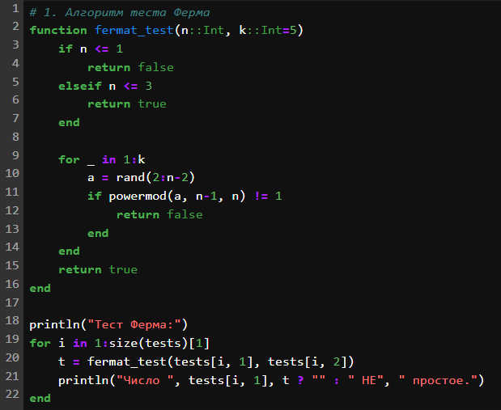
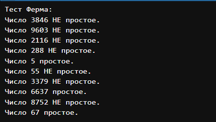
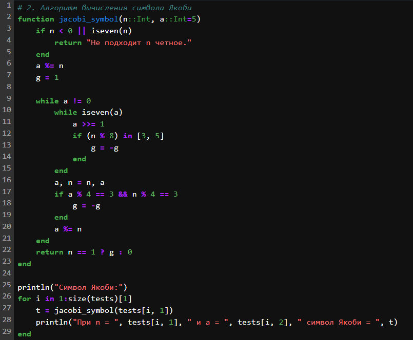
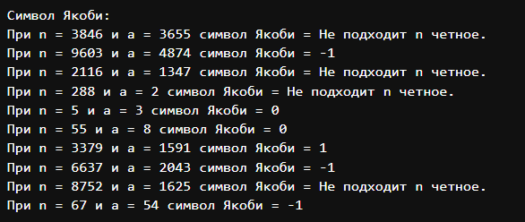
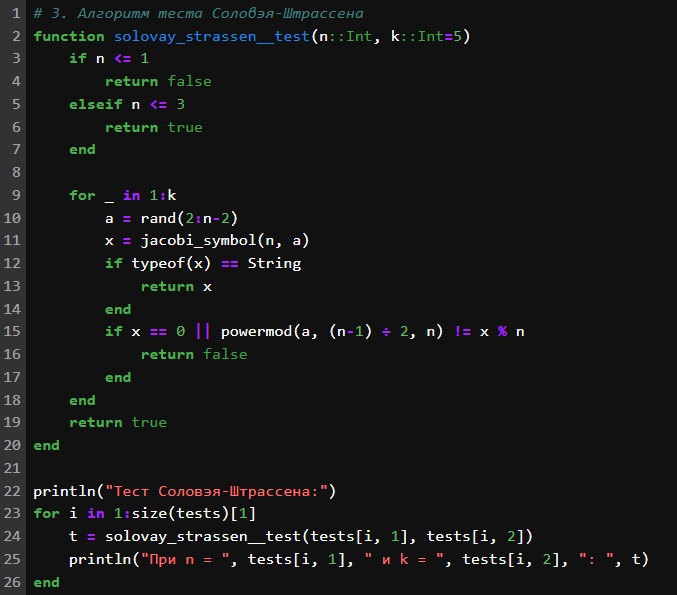
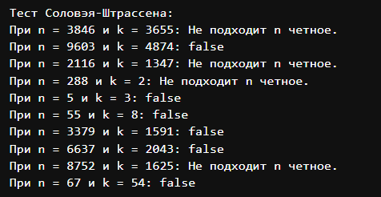
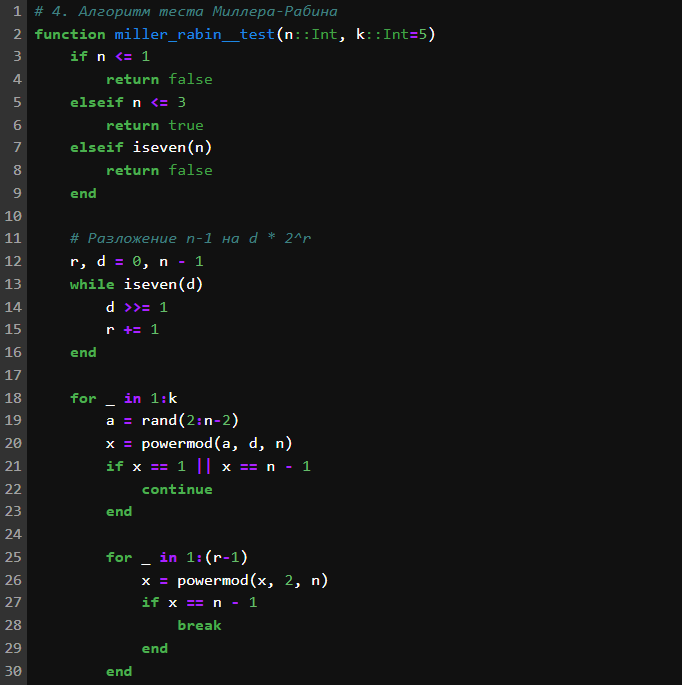
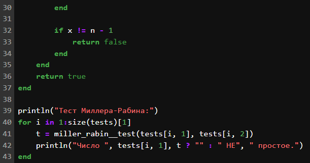
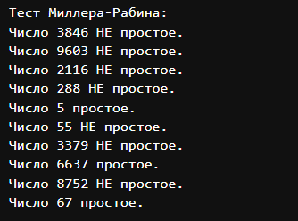

---
## Front matter
lang: ru-RU
title: "Лабораторная работа №5: отчет."
subtitle: "вероятностные алгоритмы проверки чисел на простоту"
author: "Евдокимов Максим Михайлович. Группа - НФИмд-01-24."

## Generic otions
lang: ru-RU
toc-title: "Содержание"

## Bibliography
bibliography: bib/cite.bib
csl: pandoc/csl/gost-r-7-0-5-2008-numeric.csl

## Pdf output format
toc: true # Table of contents
toc-depth: 2
lof: true # List of figures
fontsize: 12pt
linestretch: 1.5
papersize: a4
documentclass: scrreprt
## I18n polyglossia
polyglossia-lang:
  name: russian
  options:
	- spelling=modern
	- babelshorthands=true
polyglossia-otherlangs:
  name: english
## I18n babel
babel-lang: russian
babel-otherlangs: english
## Fonts
mainfont: PT Serif
romanfont: PT Serif
sansfont: PT Sans
monofont: PT Mono
mainfontoptions: Ligatures=TeX
romanfontoptions: Ligatures=TeX
sansfontoptions: Ligatures=TeX,Scale=MatchLowercase
monofontoptions: Scale=MatchLowercase,Scale=0.9
## Biblatex
biblatex: true
biblio-style: "gost-numeric"
biblatexoptions:
  - parentracker=true
  - backend=biber
  - hyperref=auto
  - language=auto
  - autolang=other*
  - citestyle=gost-numeric
## Pandoc-crossref LaTeX customization
figureTitle: "Рис."
listingTitle: "Листинг"
lofTitle: "Список иллюстраций"
lotTitle: "Список таблиц"
lolTitle: "Листинги"
## Misc options
indent: true
header-includes:
  - \usepackage{indentfirst}
  - \usepackage{float} # keep figures where there are in the text
  - \floatplacement{figure}{H} # keep figures where there are in the text
---

# Цели и задачи работы

## Цель лабораторной работы

Вероятностные алгоритмы проверки чисел на простоту

## Задание

1. Реализовать алгоритм теста Ферма.
2. Реализовать алгоритм вычисления символа Якоби.
3. Реализовать алгоритм теста Соловэя-Штрассена.
4. Реализовать алгоритм теста Миллера-Рабина.

# Теоретическое введение

## Тест Ферма

Тест Ферма основан на малой теореме Ферма, которая утверждает, что если 
n — простое число, то для любого целого $a$ такого, что $1 \leq a < n$, выполняется:
$a^{n-1} \equiv 1 \mod n$

### Алгоритм действий:

1. Выбрать случайное число $a$ такое, что $1 \leq a < n$.
2. Вычислить $a^{n-1} \mod n$.
3. Если $a^{n-1} \not\equiv 1 \mod n$, то $n$ — составное.
4. Если $a^{n-1} \equiv 1 \mod n$$, то $n$ вероятно простое.

### Сравнение:

- **Плюсы:** Простой и быстрый.
- **Минусы:** Подвержен "числам Кармайкла" составным числам, которые проходят тест для всех $a$.

## Символ Якоби

**Символ Якоби** — это обобщение символа Лежандра на случай, когда знаменатель 
является нечетным составным числом. Символ Якоби $(\frac{a}{n})$ определяется 
для целого числа $a$ и нечетного натурального числа $n$.

Если $n$ — простое число, то символ Якоби совпадает с символом Лежандра. 
Символ Лежандра $(\frac{a}{p})$ определяется для целого числа $a$ и простого числа 
$p$ и указывает, является ли $a$ квадратичным вычетом по модулю $p$.

### Свойства символа Якоби

1. **Мультипликативность:**

   $$(\frac{ab}{n}) = (\frac{a}{n}) (\frac{b}{n})$$

2. **Симметрия:**

   $$(\frac{a}{n}) = (\frac{a \mod n}{n})$$

3. **Квадратичный закон взаимности:**

   Для нечетных натуральных чисел $a$ и $b$:
   $$(\frac{a}{b}) (\frac{b}{a}) = (-1)^{\frac{(a-1)(b-1)}{4}}$$

4. **Свойства для $a = -1$ и $a = 2$:**

   $$(\frac{-1}{n}) = (-1)^{\frac{n-1}{2}}$$

   $$(\frac{2}{n}) = (-1)^{\frac{n^2-1}{8}}$$

## Тест Соловея-Штрассена

Тест Соловея-Штрассена использует символ Якоби и малую теорему Ферма для определения вероятности простоты числа.

### Алгоритм действий:

1. Выбрать случайное число $a$ такое, что $1 \leq a < n$.
2. Вычислить символ Якоби $(\frac{a}{n})$.
3. Вычислить $a^{(n-1)/2} \mod n$.
4. Если $(\frac{a}{n}) \not\equiv a^{(n-1)/2} \mod n$, то $n$ — составное.
5. Если $(\frac{a}{n}) \equiv a^{(n-1)/2} \mod n$, то $n$ вероятно простое.

### Сравнение:

- **Плюсы:** Более надежный, чем тест Ферма, так как не подвержен "числам Кармайкла".
- **Минусы:** Требует вычисления символа Якоби, что может быть сложнее.

## Тест Миллера-Рабина

Тест Миллера-Рабина — это вероятностный тест, основанный на расширении 
малой теоремы Ферма и использующий свойства квадратичных вычетов.

### Алгоритм действий:

1. Представить $n-1$ как $2^s \cdot d$, где $d$ — нечетное.
2. Выбрать случайное число $a$ такое, что $1 \leq a < n$.
3. Вычислить $a^d \mod n$.
4. Если $a^d \equiv 1 \mod n$ или $a^d \equiv -1 \mod n$, то $n$ вероятно простое.
5. Иначе, вычислить $a^{2^r \cdot d} \mod n$ для $r = 1, 2, ..., s-1$.
6. Если для какого-то $r$ выполняется $a^{2^r \cdot d} \equiv -1 \mod n$, то $n$ вероятно простое.
7. Если ни одно из условий не выполняется, то $n$ — составное.

### Сравнение:

- **Плюсы:** Один из самых надежных вероятностных тестов, не подвержен "числам Кармайкла".
- **Минусы:** Требует больше вычислений, чем тест Ферма.

## Вывод:

- **Тест Ферма** — простой, но подвержен "числам Кармайкла".
- **Тест Соловея-Штрассена** — более надежный, чем Ферма, но требует вычисления символа Якоби.
- **Тест Миллера-Рабина** — самый надежный из трех, но требует больше вычислений.

Каждый из этих тестов дает вероятностный результат, и для 
подтверждения простоты числа обычно используют несколько 
итераций теста.

# Ход работы

## Подготовка

Так для тестирования работы кода я создал простой шаблон 
генерирующий наше случайное число для проверки, а также 
необходимые для каждого алгоритма коэффициент или параметр
который гарантированно меньше исходного, но не меньше 1.

{#fig:001 width=70% height=40%}

## Алгоритм теста Ферма

{#fig:002 width=70% height=40%}

## Результат 1

{#fig:003 width=70% height=40%}

## Алгоритм вычисления символа Якоби

Если посмотреть на полученный результаты может показаться что при данных значениях 
нет ни одного число которое при использовании теста Соловэя-Штрассена. Для проверки
рассмотрим случай номер 5 при значениях n = 5 (число для проверки) и a = 3 
(случайное число) оба при этом оказались простыми.

1. Начнём с символа Якоби: 3/5; 5 - простое и совпадает с символом Лежандра который 
вычисляем как 5/3 => 2/3 а, так как 2 = mod(3) и не является квадратом по модулю 3 то 2/3 = -1 => 3/5 => -1
2. Теперь вычислим $a^{(n-1)/2} * \mod n$ => $3^{(5-1)/2} * \mod 5$ => $3^{2} * mod 5 = 4$
3. Сравним: -1 и 4 не ровны значит чисто по тесту Соловея-Штрассена при a = 3 и n = 5, 
n не простое. При других значениях $a$ возможно он даст правильный ответ, но не здесь.

{#fig:004 width=70% height=40%}

## Результат 2

{#fig:005 width=70% height=40%}

## Алгоритм теста Соловэя-Штрассена

{#fig:006 width=70% height=40%}

## Результат 3

{#fig:007 width=70% height=40%}

## Алгоритм теста Миллера-Рабина

{#fig:008 width=70% height=40%}

{#fig:009 width=70% height=40%}

## Результат 4

{#fig:010 width=70% height=40%}

# Выводы по проделанной работе

## Вывод

В ходе выполнения лабораторной работе выли изучены такие способы 
определение простоты числа как алгоритм теста Ферма, алгоритм 
теста Миллера-Рабина и алгоритм теста Соловэя-Штрассена, и 
алгоритм вычисления символа Якоби.

# Список литературы {.unnumbered}

1. [Свойства символа Якоби и Тест на простоту Соловея-Штрассена](https://studfile.net/preview/6268704/page:17/)
2. [Метод Соловея -Штрассена для проверки на простоту](https://www.geeksforgeeks.org/solovay-strassen-method-of-primality-test/)
3. [Primality Test | Set 3 (Miller–Rabin)](https://www.geeksforgeeks.org/primality-test-set-3-miller-rabin/)
4. [Тесты Ферма и Миллера-Рабина на простоту](https://habr.com/ru/companies/otus/articles/486116/)
5. [Алгоритм Соловея-Штрассена](https://habr.com/ru/articles/127544/)
