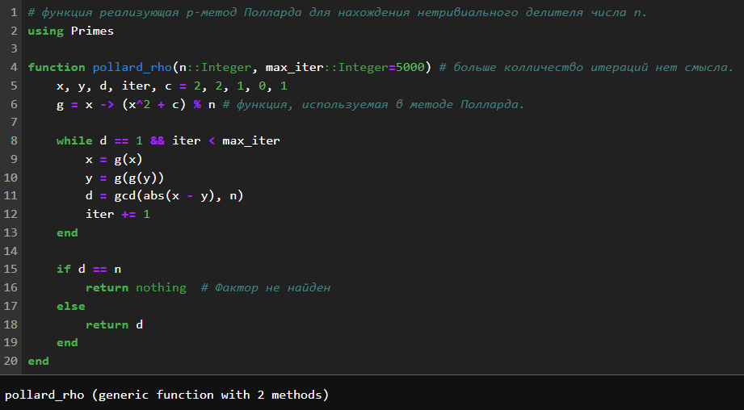
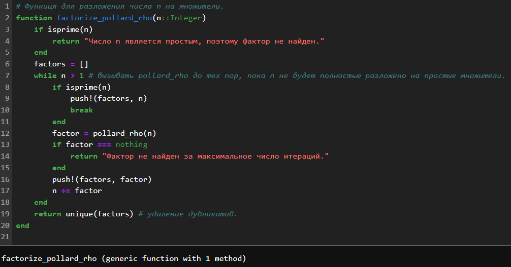
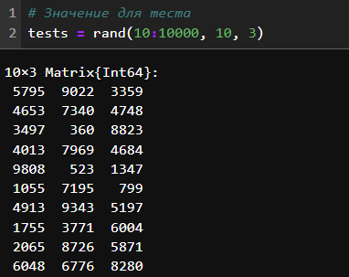
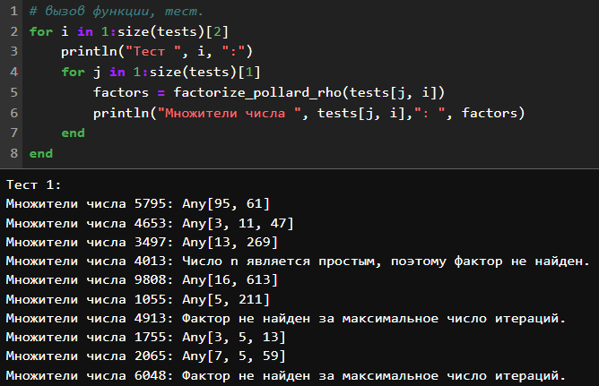
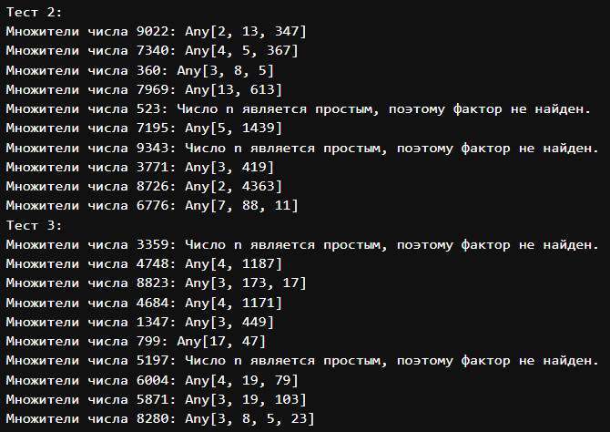

---
## Front matter
lang: ru-RU
title: "Лабораторная работа №6: отчет."
subtitle: "Разложение чисел на множители"
author: "Евдокимов Максим Михайлович. Группа - НФИмд-01-24."

## Generic otions
lang: ru-RU
toc-title: "Содержание"

## Bibliography
bibliography: bib/cite.bib
csl: pandoc/csl/gost-r-7-0-5-2008-numeric.csl

## Pdf output format
toc: true # Table of contents
toc-depth: 2
lof: true # List of figures
fontsize: 12pt
linestretch: 1.5
papersize: a4
documentclass: scrreprt
## I18n polyglossia
polyglossia-lang:
  name: russian
  options:
	- spelling=modern
	- babelshorthands=true
polyglossia-otherlangs:
  name: english
## I18n babel
babel-lang: russian
babel-otherlangs: english
## Fonts
mainfont: PT Serif
romanfont: PT Serif
sansfont: PT Sans
monofont: PT Mono
mainfontoptions: Ligatures=TeX
romanfontoptions: Ligatures=TeX
sansfontoptions: Ligatures=TeX,Scale=MatchLowercase
monofontoptions: Scale=MatchLowercase,Scale=0.9
## Biblatex
biblatex: true
biblio-style: "gost-numeric"
biblatexoptions:
  - parentracker=true
  - backend=biber
  - hyperref=auto
  - language=auto
  - autolang=other*
  - citestyle=gost-numeric
## Pandoc-crossref LaTeX customization
figureTitle: "Рис."
listingTitle: "Листинг"
lofTitle: "Список иллюстраций"
lotTitle: "Список таблиц"
lolTitle: "Листинги"
## Misc options
indent: true
header-includes:
  - \usepackage{indentfirst}
  - \usepackage{float} # keep figures where there are in the text
  - \floatplacement{figure}{H} # keep figures where there are in the text
---

# Цели и задачи работы

## Цель лабораторной работы

Изучить представленные способы разложение чисел на множители и 
реализовать их в коде.

## Задание

Реализовать рассмотренные алгоритмы программно (алгоритм реализующий 
p-метод Полларда).

# Теоретическое введение

## Метод разложения числа на множители: p-метод Полларда

p-метод Полларда (метод ρ-Полларда) — это вероятностный алгоритм 
факторизации целых чисел, который находит нетривиальный делитель 
числа $n$ за время, пропорциональное $\sqrt[4]{n}$.

Алгоритм основан на поиске цикла в псевдослучайной последовательности 
чисел, получаемой с помощью некоторой функции $f(x)$, примененной к 
числу $x$ по модулю $n$. 

### Алгоритм:

1. Выбираем начальное значение $x_0$ и функцию $f(x)$, например, $f(x) = x^2 + 1$.
2. Строим две последовательности чисел:
   - $x_i$ — последовательность, получаемая итеративным применением функции $f(x)$: $x_{i+1} = f(x_i) \mod n$.
   - $y_i$ — последовательность, получаемая с задержкой: $y_{i+1} = f(f(y_i)) \mod n$.
3. Вычисляем наибольший общий делитель $\text{НОД}(|x_i - y_i|, n)$ на каждом шаге.
4. Если $\text{НОД} \neq 1$ и $\text{НОД} \neq n$, то мы нашли нетривиальный делитель $n$.
5. Если $\text{НОД} = n$, то алгоритм завершился неудачно, и нужно выбрать другое начальное значение $x_0$ или функцию $f(x)$.

### Особенности:

- **Эффективность:** В среднем алгоритм работает за время $O(n^{1/4})$, что значительно быстрее полного перебора делителей.
- **Вероятностный:** Алгоритм не гарантирует нахождение делителя, и в худшем случае может работать долго.
- **Простота реализации:** Алгоритм легко реализуется и требует небольшого объема памяти.
- **Применимость:** Метод хорошо подходит для факторизации чисел среднего размера (до 100 десятичных цифр).

### Пример:

Рассмотрим число $n = 8051$.

1. Выбираем $x_0 = 2$ и $f(x) = x^2 + 1$.
2. Строим последовательности:
   - $x_1 = f(2) = 5$
   - $y_1 = f(f(2)) = 26$
3. Вычисляем $\text{НОД}(|5 - 26|, 8051) = 97$.
4. 97 — нетривиальный делитель 8051.

### Заключение:

P-метод Полларда — это эффективный и простой в реализации алгоритм 
факторизации, который широко используется в криптографии и других областях.

# Ход работы

## Функция p-метод Полларда

{#fig:001 width=60% height=40%}

## Функция разложения и проверки числа n

{#fig:002 width=60% height=40%}

## Результаты

{#fig:003 width=60% height=40%}

{#fig:004 width=60% height=40%}

{#fig:005 width=60% height=40%}

# Выводы по проделанной работе

## Вывод

В ходе выполнения лабораторной работы я изучил способ нахождение всех 
множителей числа алгоритмом реализующим p-метод Полларда.

# Список литературы {.unnumbered}

1. [Глава 2. Факторизация целых чисел с экспоненциальной сложностью](https://studfile.net/preview/2439346/page:7/)
2. [P-1 метод Полларда](https://algolist.ru/maths/teornum/factor/p-1.php)
3. [Оптимизация (p — 1)-алгоритма Полларда Климина Александра Сергеевна](https://cyberleninka.ru/article/n/optimizatsiya-p-1-algoritma-pollarda)
4. [Факторизация Целых Чисел](https://habr.com/ru/sandbox/163811/)
