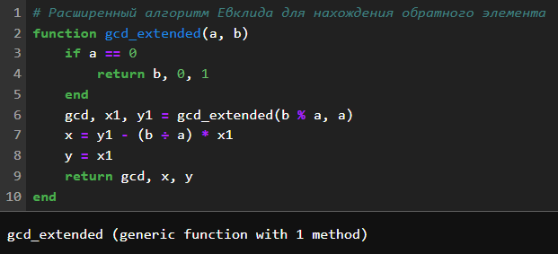
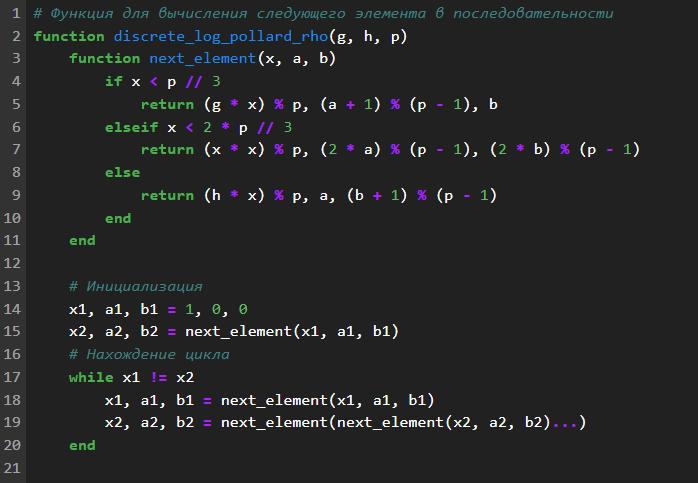
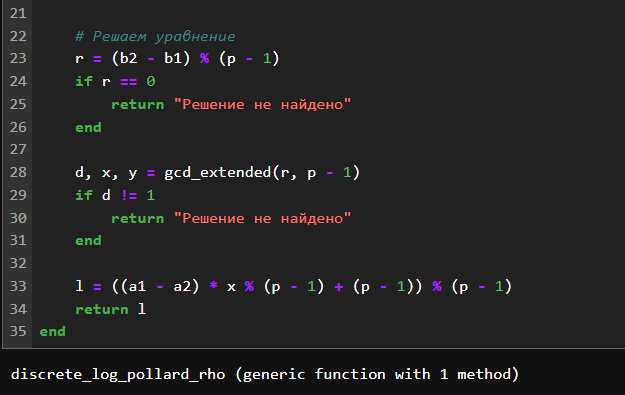
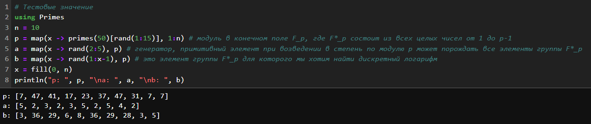
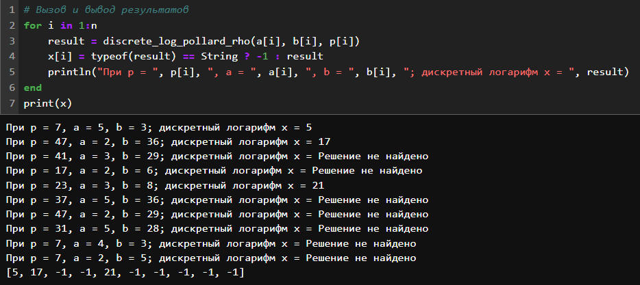
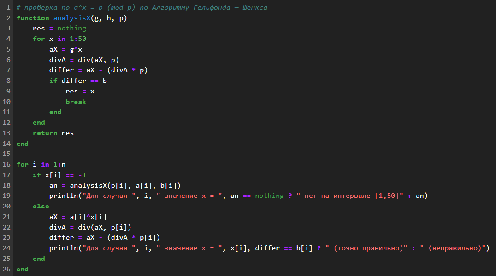
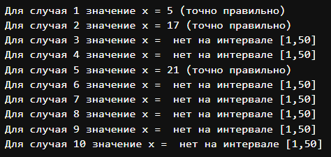

---
## Front matter
lang: ru-RU
title: "Лабораторная работа №7: Презентация."
subtitle: 
  Дискретное логарифмирование в конечном поле.
author: 
    Евдокимов Максим Михайлович. Группа - НФИмд-01-24.\inst{1}
institute: 
    \inst{1}Российский Университет Дружбы Народов

date: 04 октября, 2024, Москва, Россия

## i18n babel
babel-lang: russian
babel-otherlangs: english

## Formatting pdf
toc: false
toc-title: Содержание
slide_level: 2
aspectratio: 169
section-titles: true
theme: metropolis
header-includes:
 - \metroset{progressbar=frametitle,sectionpage=progressbar,numbering=fraction}
 - '\makeatletter'
 - '\beamer@ignorenonframefalse'
 - '\makeatother'
---

# Цели и задачи работы

## Цель лабораторной работы

Вычисление дискретных логарифмов в конечном поле.

## Задание

Реализовать алгоритм, реализующий р-Метод Полларда для задач дискретного 
логарифмирования программно.

# Теоретическое введение

## алгоритм р-Метод Полларда для задач дискретного логарифмирования

p-Метод Полларда (Pollard's rho method for discrete logarithms) — это алгоритм, 
используемый для решения задачи дискретного логарифмирования в конечных полях. Задача 
дискретного логарифмирования заключается в нахождении целого числа $x$ такого, что:

$$ g^x \equiv h \pmod{p} $$

где $g$, $h$, и $p$ — известные целые числа, а $p$ — простое число.

---

### Основные шаги алгоритма

1. **Разделение последовательности**:
   - Последовательность $\{g^0, g^1, g^2, ..., g^{p-1}\}$ разбивается на три 
   подмножества $S_0$, $S_1$, и $S_2$ на основе некоторого правила. Например, 
   можно использовать остаток от деления на 3.

2. **Функция перехода**:
   - Определяется функция перехода $f(x)$, которая перемещает элементы между 
   подмножествами. Обычно используется следующая функция:

$$f(x) = \begin{cases}
x \cdot g \pmod{p} & \text{если } x \in S_0, \\
x \cdot h \pmod{p} & \text{если } x \in S_1, \\
x^2 \pmod{p} & \text{если } x \in S_2.
\end{cases}$$

---

3. **Поиск коллизии**:
   - Используем метод "черепахи и зайца" для поиска коллизии.

4. **Решение уравнения**:
   - Пусть найдены $i = 5$ и $j = 10$. Тогда:
     $$ 5^5 \equiv 3 \pmod{7} $$
     Проверяем:
     $$ 5^5 = 3125 \equiv 3 \pmod{7} $$
     Таким образом, $x = 5$ является решением.

# Ход работы

## Расширенный алгоритм Евклида для нахождения обратного элемента

{#fig:001 width=50% height=50%}

## Функция для вычисления следующего элемента в последовательности

{#fig:002 width=50% height=50%}

---

{#fig:003 width=50% height=50%}

## Тестовые значение

{#fig:004 width=70% height=50%}

## Результаты и тесты

{#fig:005 width=60% height=50%}

---

{#fig:006 width=50% height=50%}

---

{#fig:007 width=50% height=50%}

# Выводы по проделанной работе

## Вывод

В ходе выполнение лабораторной работы был изучен и реализован способ определения 
дискретного логарифма для дискретного логарифмирования в конечном поле с использованием 
алгоритм, реализующий р-Метод Полларда для задач дискретного логарифмирования.
