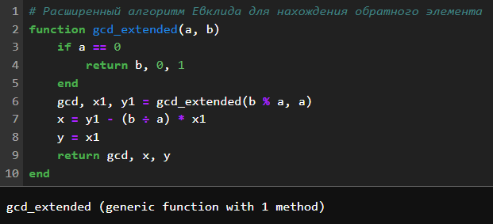
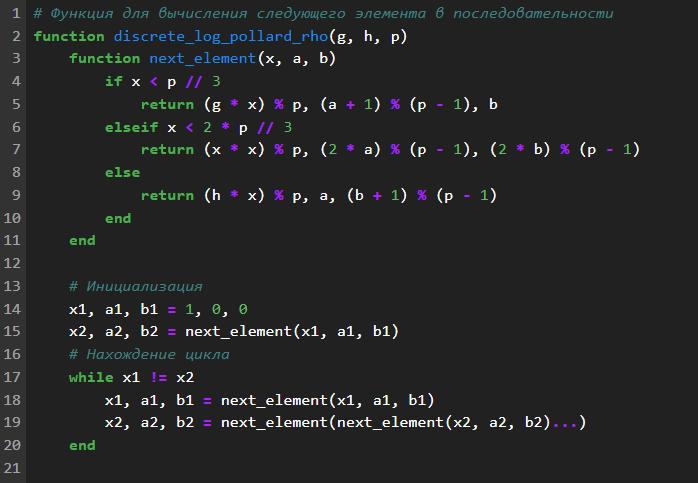
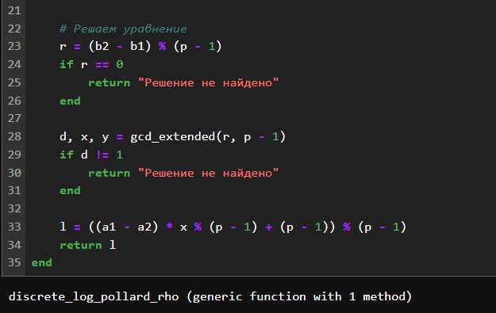
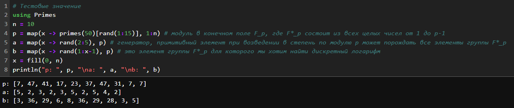
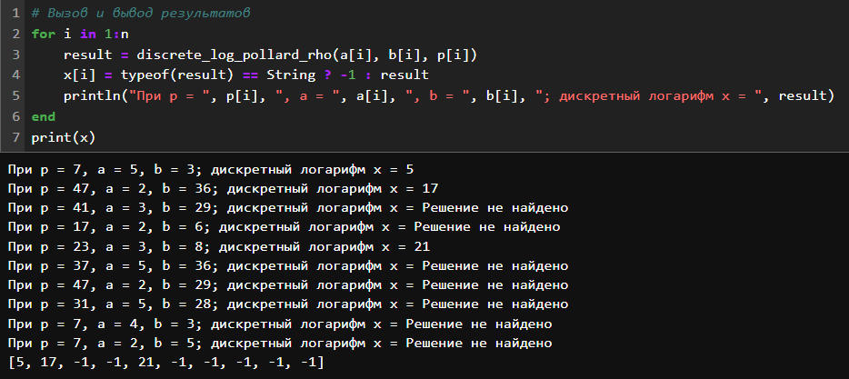
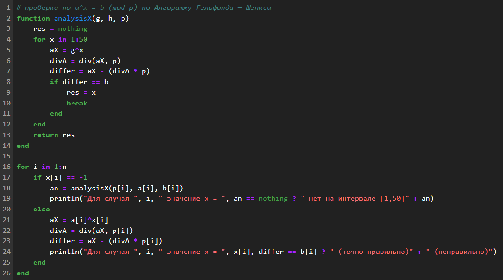
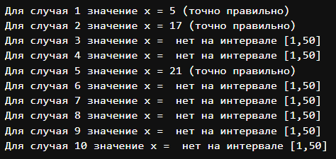

---
## Front matter
lang: ru-RU
title: "Лабораторная работа №7: отчет."
subtitle: "Дискретное логарифмирование в конечном поле"
author: "Евдокимов Максим Михайлович. Группа - НФИмд-01-24."

## Generic otions
lang: ru-RU
toc-title: "Содержание"

## Bibliography
bibliography: bib/cite.bib
csl: pandoc/csl/gost-r-7-0-5-2008-numeric.csl

## Pdf output format
toc: true # Table of contents
toc-depth: 2
lof: true # List of figures
fontsize: 12pt
linestretch: 1.5
papersize: a4
documentclass: scrreprt
## I18n polyglossia
polyglossia-lang:
  name: russian
  options:
	- spelling=modern
	- babelshorthands=true
polyglossia-otherlangs:
  name: english
## I18n babel
babel-lang: russian
babel-otherlangs: english
## Fonts
mainfont: PT Serif
romanfont: PT Serif
sansfont: PT Sans
monofont: PT Mono
mainfontoptions: Ligatures=TeX
romanfontoptions: Ligatures=TeX
sansfontoptions: Ligatures=TeX,Scale=MatchLowercase
monofontoptions: Scale=MatchLowercase,Scale=0.9
## Biblatex
biblatex: true
biblio-style: "gost-numeric"
biblatexoptions:
  - parentracker=true
  - backend=biber
  - hyperref=auto
  - language=auto
  - autolang=other*
  - citestyle=gost-numeric
## Pandoc-crossref LaTeX customization
figureTitle: "Рис."
listingTitle: "Листинг"
lofTitle: "Список иллюстраций"
lotTitle: "Список таблиц"
lolTitle: "Листинги"
## Misc options
indent: true
header-includes:
  - \usepackage{indentfirst}
  - \usepackage{float} # keep figures where there are in the text
  - \floatplacement{figure}{H} # keep figures where there are in the text
---

# Цели и задачи работы

## Цель лабораторной работы

Вычисление дискретных логарифмов в конечном поле.

## Задание

Реализовать алгоритм, реализующий р-Метод Полларда для задач дискретного 
логарифмирования программно.

# Теоретическое введение

## алгоритм р-Метод Полларда для задач дискретного логарифмирования

p-Метод Полларда (Pollard's rho method for discrete logarithms) — это алгоритм, 
используемый для решения задачи дискретного логарифмирования в конечных полях. Задача 
дискретного логарифмирования заключается в нахождении целого числа $x$ такого, что:

$$ g^x \equiv h \pmod{p} $$

где $g$, $h$, и $p$ — известные целые числа, а $p$ — простое число.

### Основные шаги алгоритма

1. **Разделение последовательности**:
   - Последовательность $\{g^0, g^1, g^2, ..., g^{p-1}\}$ разбивается на три 
   подмножества $S_0$, $S_1$, и $S_2$ на основе некоторого правила. Например, 
   можно использовать остаток от деления на 3.

2. **Функция перехода**:
   - Определяется функция перехода $f(x)$, которая перемещает элементы между 
   подмножествами. Обычно используется следующая функция:

$$f(x) = \begin{cases}
x \cdot g \pmod{p} & \text{если } x \in S_0, \\
x \cdot h \pmod{p} & \text{если } x \in S_1, \\
x^2 \pmod{p} & \text{если } x \in S_2.
\end{cases}$$

3. **Поиск коллизии**:
   - Используем метод "черепахи и зайца" для поиска коллизии.

4. **Решение уравнения**:
   - Пусть найдены $i = 5$ и $j = 10$. Тогда:
     $$ 5^5 \equiv 3 \pmod{7} $$
     Проверяем:
     $$ 5^5 = 3125 \equiv 3 \pmod{7} $$
     Таким образом, $x = 5$ является решением.

### Применение алгоритма

Алгоритм p-Метода Полларда используется для решения задач дискретного логарифмирования в криптографии, где эта задача играет важную роль. Например, в системах шифрования на основе эллиптических кривых и в протоколах обмена ключами Диффи-Хеллмана.

### Преимущества и недостатки

**Преимущества**:
- **Эффективность**: Алгоритм работает быстрее, чем полный перебор, особенно для больших $p$.
- **Простота реализации**: Алгоритм относительно прост в реализации.

**Недостатки**:
- **Не гарантирует успех**: Алгоритм может не найти решение, если не найдена коллизия.
- **Зависимость от параметров**: Эффективность алгоритма зависит от выбора параметров $S_0$, $S_1$, и $S_2$.

### Заключение

Алгоритм p-Метода Полларда — это мощный инструмент для решения задач дискретного логарифмирования в конечных полях. Он использует метод "черепахи и зайца" для поиска коллизий и позволяет эффективно находить решения в криптографических задачах.

# Ход работы

## Расширенный алгоритм Евклида для нахождения обратного элемента

{#fig:001 width=50% height=50%}

## Функция для вычисления следующего элемента в последовательности

{#fig:002 width=50% height=50%}

{#fig:003 width=50% height=50%}

## Тестовые значение

{#fig:004 width=70% height=50%}

## Результаты и тесты

{#fig:005 width=60% height=50%}

{#fig:006 width=50% height=50%}

{#fig:007 width=50% height=50%}

# Выводы по проделанной работе

## Вывод

В ходе выполнение лабораторной работы был изучен и реализован способ определения 
дискретного логарифма для дискретного логарифмирования в конечном поле с использованием 
алгоритм, реализующий р-Метод Полларда для задач дискретного логарифмирования.

# Список литературы {.unnumbered}

1. [Параллельный метод Полларда решения задачи дискретного логарифмирования с
использованием детерминированной функции разбиения на множества](http://omega.sp.susu.ru/books/conference/PaVT2013/talks/Pogrebnyak.pdf)
2. [Поиск дискретного логарифма 2015 Сергей Николенко](https://logic.pdmi.ras.ru/~sergey/teaching/cryptoclub15/08-discretelog.pdf)
3. [Доступно о криптографии на эллиптических кривых](https://habr.com/ru/articles/335906/)
