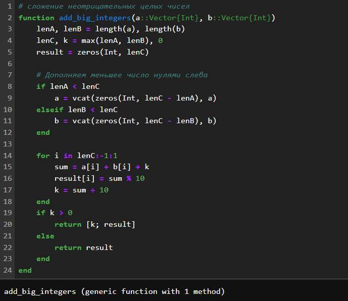
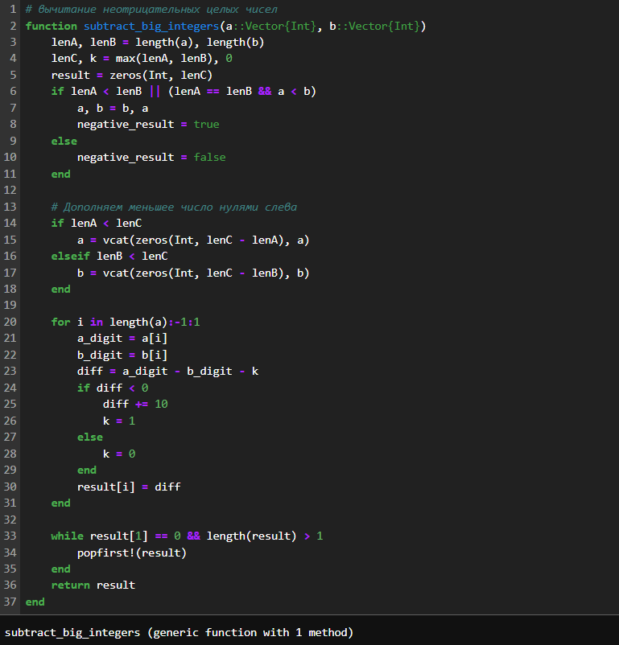
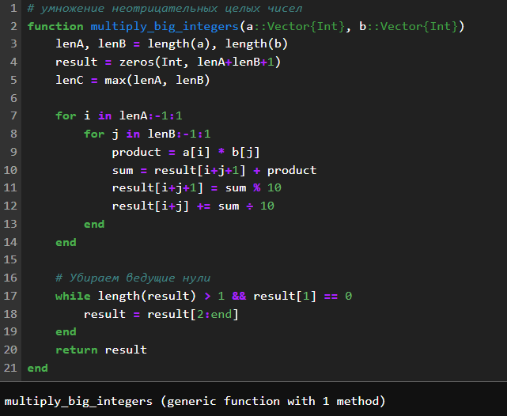
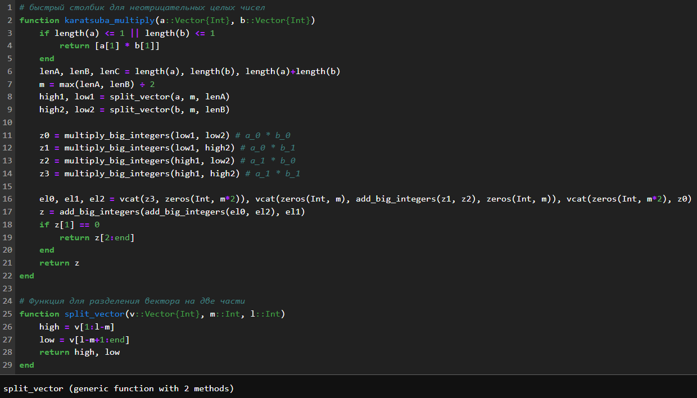
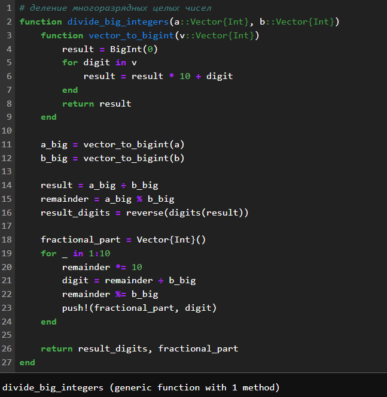
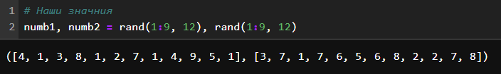
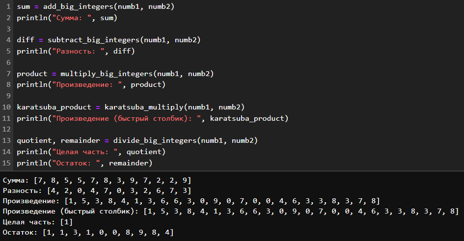

---
## Front matter
lang: ru-RU
title: "Лабораторная работа №8: отчет."
subtitle: "Целочисленная арифметика многократной точности"
author: "Евдокимов Максим Михайлович. Группа - НФИмд-01-24."

## Generic otions
lang: ru-RU
toc-title: "Содержание"

## Bibliography
bibliography: bib/cite.bib
csl: pandoc/csl/gost-r-7-0-5-2008-numeric.csl

## Pdf output format
toc: true # Table of contents
toc-depth: 2
lof: true # List of figures
fontsize: 12pt
linestretch: 1.5
papersize: a4
documentclass: scrreprt
## I18n polyglossia
polyglossia-lang:
  name: russian
  options:
	- spelling=modern
	- babelshorthands=true
polyglossia-otherlangs:
  name: english
## I18n babel
babel-lang: russian
babel-otherlangs: english
## Fonts
mainfont: PT Serif
romanfont: PT Serif
sansfont: PT Sans
monofont: PT Mono
mainfontoptions: Ligatures=TeX
romanfontoptions: Ligatures=TeX
sansfontoptions: Ligatures=TeX,Scale=MatchLowercase
monofontoptions: Scale=MatchLowercase,Scale=0.9
## Biblatex
biblatex: true
biblio-style: "gost-numeric"
biblatexoptions:
  - parentracker=true
  - backend=biber
  - hyperref=auto
  - language=auto
  - autolang=other*
  - citestyle=gost-numeric
## Pandoc-crossref LaTeX customization
figureTitle: "Рис."
listingTitle: "Листинг"
lofTitle: "Список иллюстраций"
lotTitle: "Список таблиц"
lolTitle: "Листинги"
## Misc options
indent: true
header-includes:
  - \usepackage{indentfirst}
  - \usepackage{float} # keep figures where there are in the text
  - \floatplacement{figure}{H} # keep figures where there are in the text
---

# Цели и задачи работы

## Цель лабораторной работы

Реализовать все рассмотренные алгоритмы программно.

## Задание

1. сложение неотрицательных целых чисел.
2. вычитание неотрицательных целых чисел.
3. умножение неотрицательных целых чисел.
4. быстрый столбик.
5. деление многоразрядных целых чисел.

# Теоретическое введение

## Сложение неотрицательных целых чисел:

Алгоритм сложения двух многоразрядных неотрицательных целых чисел, 
представленных в виде массивов цифр.

### Алгоритм:

1. Инициализировать перенос нулем.
2. Для каждой цифры с наименьшего разряда:
3. Сложить соответствующие цифры двух чисел и перенос.
4. Записать младшую цифру результата в текущий разряд.
5. Обновить перенос.
6. Если после последнего разряда остался перенос, добавить его в результат.

## Вычитание неотрицательных целых чисел:

Алгоритм вычитания двух многоразрядных неотрицательных целых чисел, 
представленных в виде массивов цифр, при условии, что первое число больше 
или равно второму.

### Алгоритм:

1. Инициализировать заем нулем. 
2. Для каждой цифры с наименьшего разряда:
3. Вычесть из соответствующей цифры первого числа цифру второго числа и заем. 
4. Если результат отрицательный, добавить 10 и установить заем в 1. 
5. Записать результат в текущий разряд. 
6. Удалить ведущие нули из результата.

## Умножение неотрицательных целых чисел:

Алгоритм умножения двух многоразрядных неотрицательных целых чисел, 
представленных в виде массивов цифр.

### Алгоритм:

1. Инициализировать результат нулем. 
2. Для каждой цифры второго числа с наименьшего разряда:
3. Умножить первое число на эту цифру. 
4. Сдвинуть результат влево на соответствующее количество разрядов. 
5. Сложить результат с текущим результатом.

## Быстрый столбик - алгоритм Карацубы:

Алгоритм умножения двух многоразрядных неотрицательных целых чисел, 
основанный на принципе "разделяй и властвуй" и позволяющий уменьшить 
количество умножений по сравнению с классическим алгоритмом.

### Алгоритм:

1. Разделить каждое число на две равные части. 
2. Вычислить три промежуточных произведения:
3. Произведение первых частей чисел. 
4. Произведение вторых частей чисел. 
5. Произведение сумм первых и вторых частей чисел. 
6. Использовать промежуточные произведения для вычисления конечного результата.

## Деление многоразрядных целых чисел:

Алгоритм деления двух многоразрядных неотрицательных целых чисел, 
представленных в виде массивов цифр, с получением частного и остатка.

### Алгоритм:

1. Инициализировать частное и остаток нулями. 
2. Пока делимое больше или равно делителю:
3. Оценить максимально возможное значение очередной цифры частного. 
4. Умножить делитель на эту цифру и вычесть результат из делимого. 
5. Добавить цифру к частному. 
6. Остаток равен текущему значению делимого.

## Примечания:

- Все алгоритмы предполагают, что числа представлены в системе счисления с основанием 10.

- Алгоритмы могут быть адаптированы для работы с другими системами счисления.

- Алгоритм Карацубы имеет сложность O(n^log2(3)), что лучше, чем O(n^2) для классического алгоритма умножения.

# Ход работы

## Задание 1

{#fig:001 width=70% height=60%}

## Задание 2

{#fig:002 width=70% height=60%}

## Задание 3

{#fig:003 width=70% height=60%}

## Задание 4

{#fig:004 width=60% height=60%}

## Задание 5

{#fig:005 width=70% height=60%}

## Значения для проверки

{#fig:006 width=70% height=60%}

## Результаты

{#fig:007 width=70% height=60%}

# Выводы по проделанной работе

## Вывод

В ходе выполнения лабораторной работы выли изучены способы работы 
с алгоритмами целочисленной арифметики многократной точности, а также 
на их основе реализованны функции суммирования, разности, умножения, 
быстрого столбика и деления для целых неотрицательных чисел в виде векторов цифр.

# Список литературы {.unnumbered}

1. [Теоретико-числовые алгоритмы в криптографии О.Н.Василенко (Глава 10: стр. 262)](https://djvu.online/file/sNt61WMCyNUMV)
2. [Глава 10. Целочисленная арифметика многократной точности](https://studfile.net/preview/2439346/page:35/)
3. [Алгоритмы быстрого умножения чисел: от столбика до Шенхаге-Штрассена](https://habr.com/ru/articles/719648/#karatsuba)
